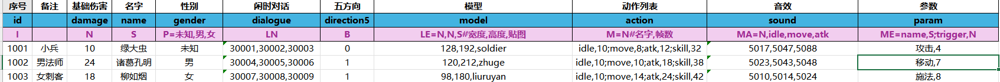
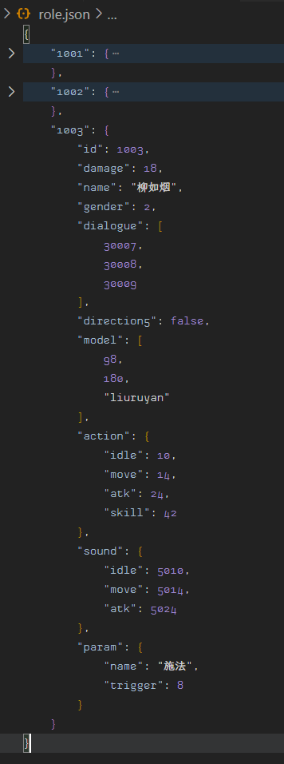
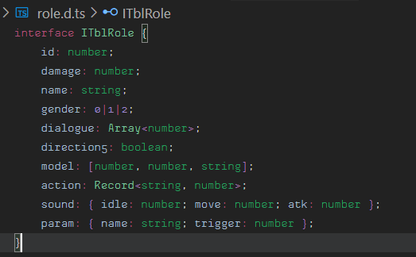
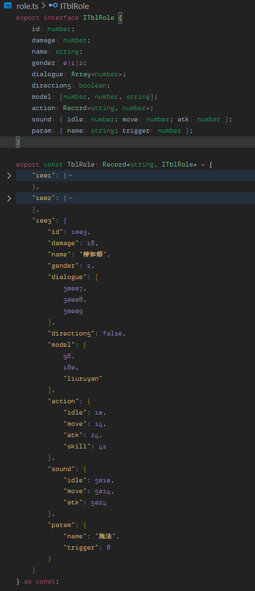
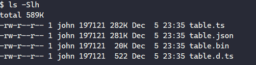

# ccc-xlsx-dump

**ccc-xlsx-dump** 是通用游戏配置表导出工具。

-   内置多种常用的规则
-   支持自定义解析规则
-   支持多种导出方式：
    -   JSON 最常用的配置格式
    -   TS 数据内置在 TS 文件中，可以直接使用
    -   DTS 类型声明
    -   BIN 压缩的二进制数据（数据量更小，当配置规模较大时可以使用这个格式）
-   支持合并导出数据为单文件（减小文件 IO，减小网络请求）
    -   合并所有 JSON
    -   合并所有 TS
    -   合并所有 DTS
    -   合并所有 BIN

## 安装

```bash
bun install
```

## 内置数据类型

| 规则         | 缩写          | 示例                  | 输入                      | 输出                             |
| ------------ | ------------- | --------------------- | ------------------------- | -------------------------------- |
| 布尔值       | `B`           | `B`                   | `0`                       | `false`                          |
| 字符串       | `S`           | `S`                   | `诸葛孔明`                | `"诸葛孔明"`                     |
| 整数         | `I`           | `I`                   | `100`                     | `100`                            |
| 数值         | `N`           | `N`                   | `100.0`                   | `100.0`                          |
| 选择器       | `P`           | `P=未知,男,女`        | `男`                      | `1`                              |
| 指定类型数组 | `L=(B/S/I/N)` | `L=B`                 | `0,1,0,1`                 | `[0,1,0,1]`                      |
| 布尔值数组   | `LB`          | `LB`                  | `0,1,0,1`                 | `[0,1,0,1]`                      |
| 字符串数组   | `LS`          | `LS`                  | `长,枪,磨,练`             | `["长","枪","磨","练"]`          |
| 整数数组     | `LI`          | `LI`                  | `1,2,3,4`                 | `[1,2,3,4]`                      |
| 数值数组     | `LN`          | `LN`                  | `100.0,200.0,300.0,400.0` | `[100.0,200.0,300.0,400.0]`      |
| 逐项类型数组 | `LE`          | `LE=N,N,S`            | `128,192,soldier`         | `[128,192,"soldier"]`            |
| 指定类型映射 | `M=(B/S/I/N)` | `M=B`                 | `sound,0;music,1`         | `{sound:false,music:true}`       |
| 布尔值映射   | `MB`          | `MB`                  | `sound,0;music,1`         | `{sound:false,music:true}`       |
| 字符串映射   | `MS`          | `MS`                  | `sound,on;music,off`      | `{sound:"on",music:"off"}`       |
| 整数映射     | `MI`          | `MI`                  | `sound,100;music,50`      | `{sound:100,music:50}`           |
| 数值映射     | `MN`          | `MN`                  | `sound,0.8;music,0.5`     | `{sound:0.8,music:0.5}`          |
| 逐项类型映射 | `ME`          | `ME=name,S;trigger,N` | `攻击,4`                  | `{name:"攻击",trigger:4}`        |
| 统一类型映射 | `MA`          | `MA=N,idle,move,atk`  | `5017,5047,5088`          | `{idle:5017,move:5047,atk:5088}` |

## 自定义解析规则

规则的好处：

-   可以灵活地解析数据，例如：复杂对象、多层嵌套、特殊格式等；
-   可以检验输入数据的有效性，将非法数据扼杀在配置层，避免在业务层由于配置错误导致的低级问题，有效减少返工和重大事故；

> 开发者可以很方便地添加自定义解析规则，只需要遵循基础的规则约定并实现 `IRule` 接口，最后通过 `Ruler.register` 进行注册即可。

> 规则约定：`规则标识[=规则参数[#规则备注]]`，例如：`P=未知,男,女#性别选择器`，`P` 是规则标识，`未知,男,女` 是规则参数，`#性别选择器` 是规则备注；其中 `规则标识` 是必填项，`规则参数` 和 `规则备注` 是可选的，主要看需求。

> 例如，我想要自定义一个**固定长度的数值数组**，可以按照如下方式实现：

```ts
// 定义规则
const FixedLengthNumberArrayRule: IRule<Array<number>> = {
    identifier: "LFN",
    parser(text: string, params?: string) {
        if (params == undefined) {
            throw new Error("FixedLengthNumberArrayRule params is required");
        }
        const len = +params!;
        const arr = text.split(",").map((v) => +v);
        if (arr.length !== len) {
            throw new Error(`FixedLengthNumberArrayRule length error, expect ${len}, got ${arr.length}`);
        }
        return arr;
    },
    transformer(rule: string, params?: string) {
        if (params == undefined) {
            throw new Error("FixedLengthNumberArrayRule params is required");
        }
        const len = +params!;
        return `{0: number, ${len}>`;
    },
};

// 注册规则
Ruler.register(FixedLengthNumberArrayRule);

// 解析文本(测试用)
const ruler = "LFN=5";
const text = "1.01,2.02,3.03,4.04,5.05";
const parsed = Ruler.parse(ruler, text);
const transformed = Ruler.transform(ruler);
console.log(parsed); // [1.01, 2.02, 3.03, 4.04, 5.05]
console.log(transformed); // {0: number, length: 5}
```

## 命令

-   `bun run index.ts -d/--dump` 导出表格配置
-   `bun run index.ts -e/--extract <bin>` 解析 BIN 文件
-   `bun run index.ts -m/--merge` 合并所有输出
-   `bun run index.ts -h/--help` 查看帮助

## 约定

### 表头

第一至三行为表头，其中：

-   第一行：字段释义
-   第二行：字段名称
-   第三行：字段规则



### 表格名称

`表格名称#备注` 其中只有表格名称会被当做文件名，备注会被忽略。


## 示例

### 导出示例

-   json 导出示例</br>
    
-   dts 导出示例</br>
    
-   ts 导出示例</br>
    

### 合并后文件大小对比

> 本次测试：角色表包含 2000 条数据。



其中：

-   TS 文件最大，因为它包含了类型声明；
-   JSON 文件次之，但和 TS 的差距不明显，因为它不包含类型声明，且表格的样本较小；
-   BIN 文件最小，因为它使用了文本压缩算法对 JSON 数据进行了二次压缩（最终大小仅为 JSON 的 7%）。

开发者可以根据需要选择合适的格式。或者使用自定义的压缩算法，本项目中使用的是 zlib 压缩算法（由 [zipson](https://github.com/jgranstrom/zipson)、[pako](https://github.com/nodeca/pako) 组合实现），开发者也可以使用其他压缩算法，例如：gzip、brotli、lz4 等。
